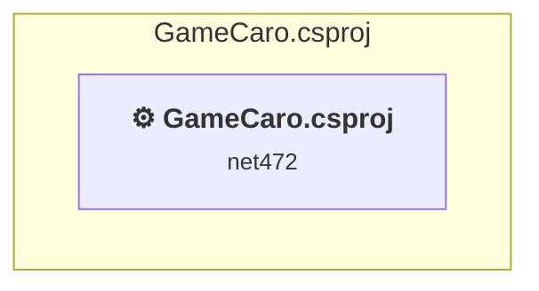

# Projects and dependencies analysis

This document provides a comprehensive overview of the projects and their dependencies in the context of upgrading to .NETCoreApp,Version=v8.0.

## Table of Contents

- [Executive Summary](#executive-Summary)
  - [Highlevel Metrics](#highlevel-metrics)
  - [Projects Compatibility](#projects-compatibility)
  - [Package Compatibility](#package-compatibility)
  - [API Compatibility](#api-compatibility)
- [Aggregate NuGet packages details](#aggregate-nuget-packages-details)
- [Top API Migration Challenges](#top-api-migration-challenges)
  - [Technologies and Features](#technologies-and-features)
  - [Most Frequent API Issues](#most-frequent-api-issues)
- [Projects Relationship Graph](#projects-relationship-graph)
- [Project Details](#project-details)

  - [GameCaro\GameCaro.csproj](#gamecarogamecarocsproj)

## Executive Summary

### Highlevel Metrics

| Metric | Count | Status |
| :--- | :---: | :--- |
| Total Projects | 1 | All require upgrade |
| Total NuGet Packages | 26 | 6 need upgrade |
| Total Code Files | 20 |  |
| Total Code Files with Incidents | 16 |  |
| Total Lines of Code | 1963 |  |
| Total Number of Issues | 1349 |  |
| Estimated LOC to modify | 1323+ | at least 67.4% of codebase |

### Projects Compatibility

| Project | Target Framework | Difficulty | Package Issues | API Issues | Est. LOC Impact | Description |
| :--- | :---: | :---: | :---: | :---: | :---: | :--- |
| [GameCaro\GameCaro.csproj](#gamecarogamecarocsproj) | net472 | 🟡 Medium | 24 | 1323 | 1323+ | ClassicWinForms, Sdk Style = False |

### Package Compatibility

| Status | Count | Percentage |
| :--- | :---: | :---: |
| ✅ Compatible | 20 | 76.9% |
| ⚠️ Incompatible | 0 | 0.0% |
| 🔄 Upgrade Recommended | 6 | 23.1% |
| ***Total NuGet Packages*** | ***26*** | ***100%*** |

### API Compatibility

| Category | Count | Impact |
| :--- | :---: | :--- |
| 🔴 Binary Incompatible | 1275 | High - Require code changes |
| 🟡 Source Incompatible | 48 | Medium - Needs re-compilation and potential conflicting API error fixing |
| 🔵 Behavioral change | 0 | Low - Behavioral changes that may require testing at runtime |
| ✅ Compatible | 1707 |  |
| ***Total APIs Analyzed*** | ***3030*** |  |

## Aggregate NuGet packages details

| Package | Current Version | Suggested Version | Projects | Description |
| :--- | :---: | :---: | :--- | :--- |
| DnsClient | 1.6.1 |  | [GameCaro.csproj](#gamecarogamecarocsproj) | ✅Compatible |
| Microsoft.Bcl.AsyncInterfaces | 5.0.0 | 8.0.0 | [GameCaro.csproj](#gamecarogamecarocsproj) | NuGet package upgrade is recommended |
| Microsoft.Extensions.Logging.Abstractions | 2.0.0 | 8.0.3 | [GameCaro.csproj](#gamecarogamecarocsproj) | NuGet package upgrade is recommended |
| Microsoft.Win32.Registry | 5.0.0 |  | [GameCaro.csproj](#gamecarogamecarocsproj) | NuGet package functionality is included with framework reference |
| MongoDB.Bson | 3.7.0 |  | [GameCaro.csproj](#gamecarogamecarocsproj) | ✅Compatible |
| MongoDB.Driver | 3.7.0 |  | [GameCaro.csproj](#gamecarogamecarocsproj) | ✅Compatible |
| SharpCompress | 0.30.1 |  | [GameCaro.csproj](#gamecarogamecarocsproj) | ✅Compatible |
| Snappier | 1.0.0 |  | [GameCaro.csproj](#gamecarogamecarocsproj) | ✅Compatible |
| System.Buffers | 4.5.1 |  | [GameCaro.csproj](#gamecarogamecarocsproj) | NuGet package functionality is included with framework reference |
| System.Diagnostics.DiagnosticSource | 6.0.1 | 8.0.1 | [GameCaro.csproj](#gamecarogamecarocsproj) | NuGet package upgrade is recommended |
| System.IO | 4.3.0 |  | [GameCaro.csproj](#gamecarogamecarocsproj) | NuGet package functionality is included with framework reference |
| System.Memory | 4.5.5 |  | [GameCaro.csproj](#gamecarogamecarocsproj) | NuGet package functionality is included with framework reference |
| System.Net.Http | 4.3.4 |  | [GameCaro.csproj](#gamecarogamecarocsproj) | NuGet package functionality is included with framework reference |
| System.Numerics.Vectors | 4.5.0 |  | [GameCaro.csproj](#gamecarogamecarocsproj) | NuGet package functionality is included with framework reference |
| System.Runtime | 4.3.0 |  | [GameCaro.csproj](#gamecarogamecarocsproj) | NuGet package functionality is included with framework reference |
| System.Runtime.CompilerServices.Unsafe | 6.0.0 | 6.1.2 | [GameCaro.csproj](#gamecarogamecarocsproj) | NuGet package upgrade is recommended |
| System.Runtime.InteropServices.RuntimeInformation | 4.3.0 |  | [GameCaro.csproj](#gamecarogamecarocsproj) | NuGet package functionality is included with framework reference |
| System.Security.AccessControl | 5.0.0 | 6.0.1 | [GameCaro.csproj](#gamecarogamecarocsproj) | NuGet package upgrade is recommended |
| System.Security.Cryptography.Algorithms | 4.3.0 |  | [GameCaro.csproj](#gamecarogamecarocsproj) | NuGet package functionality is included with framework reference |
| System.Security.Cryptography.Encoding | 4.3.0 |  | [GameCaro.csproj](#gamecarogamecarocsproj) | NuGet package functionality is included with framework reference |
| System.Security.Cryptography.Primitives | 4.3.0 |  | [GameCaro.csproj](#gamecarogamecarocsproj) | NuGet package functionality is included with framework reference |
| System.Security.Cryptography.X509Certificates | 4.3.0 |  | [GameCaro.csproj](#gamecarogamecarocsproj) | NuGet package functionality is included with framework reference |
| System.Security.Principal.Windows | 5.0.0 |  | [GameCaro.csproj](#gamecarogamecarocsproj) | NuGet package functionality is included with framework reference |
| System.Text.Encoding.CodePages | 5.0.0 | 8.0.0 | [GameCaro.csproj](#gamecarogamecarocsproj) | NuGet package upgrade is recommended |
| System.Threading.Tasks.Extensions | 4.5.4 |  | [GameCaro.csproj](#gamecarogamecarocsproj) | NuGet package functionality is included with framework reference |
| ZstdSharp.Port | 0.7.3 |  | [GameCaro.csproj](#gamecarogamecarocsproj) | ✅Compatible |

## Top API Migration Challenges

### Technologies and Features

| Technology | Issues | Percentage | Migration Path |
| :--- | :---: | :---: | :--- |
| Windows Forms | 1275 | 96.4% | Windows Forms APIs for building Windows desktop applications with traditional Forms-based UI that are available in .NET on Windows. Enable Windows Desktop support: Option 1 (Recommended): Target net9.0-windows; Option 2: Add <UseWindowsDesktop>true</UseWindowsDesktop>; Option 3 (Legacy): Use Microsoft.NET.Sdk.WindowsDesktop SDK. |
| Windows Forms Legacy Controls | 84 | 6.3% | Legacy Windows Forms controls that have been removed from .NET Core/5+ including StatusBar, DataGrid, ContextMenu, MainMenu, MenuItem, and ToolBar. These controls were replaced by more modern alternatives. Use ToolStrip, MenuStrip, ContextMenuStrip, and DataGridView instead. |
| GDI+ / System.Drawing | 46 | 3.5% | System.Drawing APIs for 2D graphics, imaging, and printing that are available via NuGet package System.Drawing.Common. Note: Not recommended for server scenarios due to Windows dependencies; consider cross-platform alternatives like SkiaSharp or ImageSharp for new code. |
| Legacy Configuration System | 2 | 0.2% | Legacy XML-based configuration system (app.config/web.config) that has been replaced by a more flexible configuration model in .NET Core. The old system was rigid and XML-based. Migrate to Microsoft.Extensions.Configuration with JSON/environment variables; use System.Configuration.ConfigurationManager NuGet package as interim bridge if needed. |

### Most Frequent API Issues

| API | Count | Percentage | Category |
| :--- | :---: | :---: | :--- |
| T:System.Windows.Forms.Label | 114 | 8.6% | Binary Incompatible |
| T:System.Windows.Forms.Button | 83 | 6.3% | Binary Incompatible |
| T:System.Windows.Forms.TextBox | 81 | 6.1% | Binary Incompatible |
| T:System.Windows.Forms.Panel | 54 | 4.1% | Binary Incompatible |
| T:System.Windows.Forms.ToolStripMenuItem | 48 | 3.6% | Binary Incompatible |
| T:System.Windows.Forms.DataGridView | 42 | 3.2% | Binary Incompatible |
| P:System.Windows.Forms.Control.Location | 39 | 2.9% | Binary Incompatible |
| P:System.Windows.Forms.Control.Name | 38 | 2.9% | Binary Incompatible |
| T:System.Windows.Forms.Control.ControlCollection | 35 | 2.6% | Binary Incompatible |
| P:System.Windows.Forms.Control.Controls | 35 | 2.6% | Binary Incompatible |
| M:System.Windows.Forms.Control.ControlCollection.Add(System.Windows.Forms.Control) | 34 | 2.6% | Binary Incompatible |
| P:System.Windows.Forms.Control.Size | 33 | 2.5% | Binary Incompatible |
| P:System.Windows.Forms.Control.TabIndex | 31 | 2.3% | Binary Incompatible |
| T:System.Windows.Forms.DialogResult | 28 | 2.1% | Binary Incompatible |
| T:System.Drawing.Image | 26 | 2.0% | Source Incompatible |
| T:System.Windows.Forms.PictureBox | 26 | 2.0% | Binary Incompatible |
| T:System.Windows.Forms.MessageBoxIcon | 22 | 1.7% | Binary Incompatible |
| T:System.Windows.Forms.MessageBoxButtons | 22 | 1.7% | Binary Incompatible |
| T:System.Windows.Forms.ProgressBar | 20 | 1.5% | Binary Incompatible |
| P:System.Windows.Forms.Control.Enabled | 16 | 1.2% | Binary Incompatible |
| T:System.Windows.Forms.MenuStrip | 16 | 1.2% | Binary Incompatible |
| T:System.Windows.Forms.FormStartPosition | 15 | 1.1% | Binary Incompatible |
| T:System.Windows.Forms.AutoScaleMode | 15 | 1.1% | Binary Incompatible |
| P:System.Windows.Forms.TextBox.Text | 15 | 1.1% | Binary Incompatible |
| P:System.Windows.Forms.Label.Text | 14 | 1.1% | Binary Incompatible |
| T:System.Drawing.Bitmap | 11 | 0.8% | Source Incompatible |
| M:System.Windows.Forms.Label.#ctor | 11 | 0.8% | Binary Incompatible |
| T:System.Windows.Forms.MessageBox | 11 | 0.8% | Binary Incompatible |
| M:System.Windows.Forms.Form.#ctor | 10 | 0.8% | Binary Incompatible |
| M:System.Windows.Forms.Form.Close | 10 | 0.8% | Binary Incompatible |
| F:System.Windows.Forms.MessageBoxButtons.OK | 10 | 0.8% | Binary Incompatible |
| T:System.Windows.Forms.Timer | 10 | 0.8% | Binary Incompatible |
| P:System.Windows.Forms.Label.AutoSize | 9 | 0.7% | Binary Incompatible |
| M:System.Windows.Forms.Control.ResumeLayout(System.Boolean) | 8 | 0.6% | Binary Incompatible |
| M:System.Windows.Forms.Control.SuspendLayout | 8 | 0.6% | Binary Incompatible |
| M:System.Windows.Forms.Button.#ctor | 8 | 0.6% | Binary Incompatible |
| E:System.Windows.Forms.Control.Click | 7 | 0.5% | Binary Incompatible |
| M:System.Windows.Forms.TextBox.#ctor | 7 | 0.5% | Binary Incompatible |
| M:System.Windows.Forms.MessageBox.Show(System.Windows.Forms.IWin32Window,System.String,System.String,System.Windows.Forms.MessageBoxButtons,System.Windows.Forms.MessageBoxIcon) | 7 | 0.5% | Binary Incompatible |
| T:System.Windows.Forms.DockStyle | 6 | 0.5% | Binary Incompatible |
| T:System.Windows.Forms.DataGridViewColumnHeadersHeightSizeMode | 6 | 0.5% | Binary Incompatible |
| T:System.Windows.Forms.DataGridViewAutoSizeColumnsMode | 6 | 0.5% | Binary Incompatible |
| M:System.Windows.Forms.Control.PerformLayout | 6 | 0.5% | Binary Incompatible |
| T:System.Windows.Forms.FormBorderStyle | 6 | 0.5% | Binary Incompatible |
| P:System.Windows.Forms.ButtonBase.UseVisualStyleBackColor | 6 | 0.5% | Binary Incompatible |
| P:System.Windows.Forms.ButtonBase.Text | 6 | 0.5% | Binary Incompatible |
| P:System.Windows.Forms.ToolStripItem.Text | 6 | 0.5% | Binary Incompatible |
| P:System.Windows.Forms.ToolStripItem.Size | 6 | 0.5% | Binary Incompatible |
| P:System.Windows.Forms.ToolStripItem.Name | 6 | 0.5% | Binary Incompatible |
| T:System.Windows.Forms.PictureBoxSizeMode | 6 | 0.5% | Binary Incompatible |

## Projects Relationship Graph

Legend:
📦 SDK-style project
⚙️ Classic project

## Project Details

### GameCaro\GameCaro.csproj

#### Project Info

- **Current Target Framework:** net472
- **Proposed Target Framework:** net8.0-windows
- **SDK-style**: False
- **Project Kind:** ClassicWinForms
- **Dependencies**: 0
- **Dependants**: 0
- **Number of Files**: 22
- **Number of Files with Incidents**: 16
- **Lines of Code**: 1963
- **Estimated LOC to modify**: 1323+ (at least 67.4% of the project)

#### Dependency Graph

Legend:
📦 SDK-style project
⚙️ Classic project

### API Compatibility

| Category | Count | Impact |
| :--- | :---: | :--- |
| 🔴 Binary Incompatible | 1275 | High - Require code changes |
| 🟡 Source Incompatible | 48 | Medium - Needs re-compilation and potential conflicting API error fixing |
| 🔵 Behavioral change | 0 | Low - Behavioral changes that may require testing at runtime |
| ✅ Compatible | 1707 |  |
| ***Total APIs Analyzed*** | ***3030*** |  |

#### Project Technologies and Features

| Technology | Issues | Percentage | Migration Path |
| :--- | :---: | :---: | :--- |
| Legacy Configuration System | 2 | 0.2% | Legacy XML-based configuration system (app.config/web.config) that has been replaced by a more flexible configuration model in .NET Core. The old system was rigid and XML-based. Migrate to Microsoft.Extensions.Configuration with JSON/environment variables; use System.Configuration.ConfigurationManager NuGet package as interim bridge if needed. |
| Windows Forms Legacy Controls | 84 | 6.3% | Legacy Windows Forms controls that have been removed from .NET Core/5+ including StatusBar, DataGrid, ContextMenu, MainMenu, MenuItem, and ToolBar. These controls were replaced by more modern alternatives. Use ToolStrip, MenuStrip, ContextMenuStrip, and DataGridView instead. |
| Windows Forms | 1275 | 96.4% | Windows Forms APIs for building Windows desktop applications with traditional Forms-based UI that are available in .NET on Windows. Enable Windows Desktop support: Option 1 (Recommended): Target net9.0-windows; Option 2: Add <UseWindowsDesktop>true</UseWindowsDesktop>; Option 3 (Legacy): Use Microsoft.NET.Sdk.WindowsDesktop SDK. |
| GDI+ / System.Drawing | 46 | 3.5% | System.Drawing APIs for 2D graphics, imaging, and printing that are available via NuGet package System.Drawing.Common. Note: Not recommended for server scenarios due to Windows dependencies; consider cross-platform alternatives like SkiaSharp or ImageSharp for new code. |

